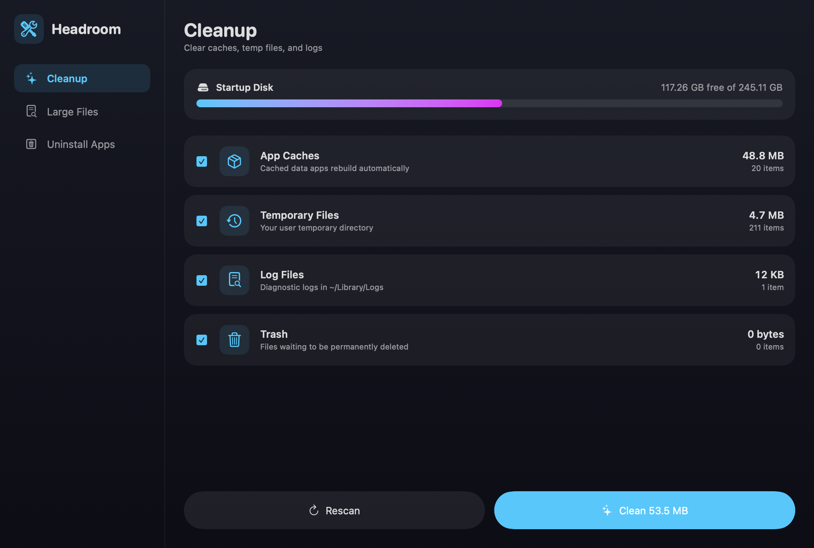
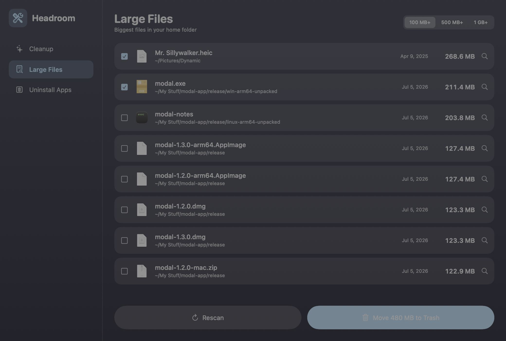
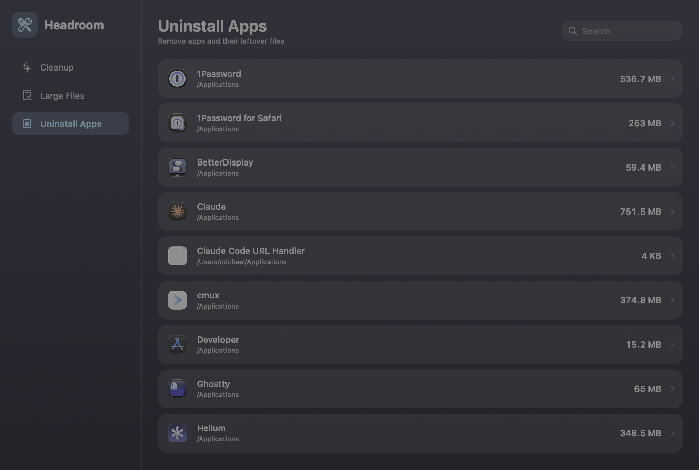

# Headroom

**A macOS disk-space utility.** Clear caches, hunt down large files, and uninstall apps cleanly — in a fast, dark-themed native app.



## Features

### 🧹 Cleanup
One click to reclaim space from locations that are safe to clear: app caches, temporary files, logs, the Trash, and Xcode's DerivedData. Scan first, see exactly how much each category holds, pick what to clean, and confirm before anything is removed.

### 📄 Large Files
Finds the biggest files in your home folder (100 MB+, 500 MB+, or 1 GB+), with size, location, and last-modified date. Reveal any file in Finder before deciding. Removal goes to the Trash, so nothing is lost until you empty it.



### 🗑 Uninstall Apps
Lists your installed apps with sizes, and finds the leftovers they scatter across `~/Library` — Application Support, Caches, Preferences, Containers, Logs, and more, matched by bundle ID and app name. Review the full list, then move the app and all its leftovers to the Trash together.



## Safety

- **Scan before clean** — nothing is removed without an explicit confirmation.
- Cleanup only deletes the *contents* of well-known regenerable locations, never your documents or app data.
- Large Files and Uninstall move items to the **Trash**, not permanent deletion.
- Apple's own apps are excluded from the uninstaller.
- Files that are locked or in use are skipped, never forced.

## Building

Requires macOS 14+ and the Swift toolchain (Command Line Tools are enough — no Xcode needed).

```sh
./build-app.sh     # builds release and packages Headroom.app
open Headroom.app
```

For development, `swift run` works directly.

### Regenerating assets

- **App icon**: `swift tools/make-icon.swift && iconutil -c icns AppIcon.iconset -o Resources/AppIcon.icns`
- **Screenshots**: `.build/debug/Headroom --screenshot docs/screenshots <cleanup|large-files|uninstaller>` renders a tab to PNG without needing screen-recording permissions.
